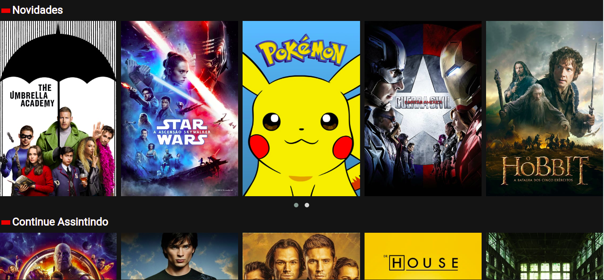
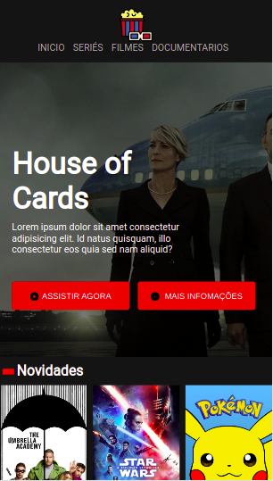
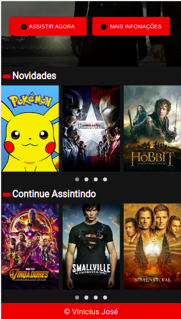

  

<h2 align="center">CloneFlix</h2>

## Technologies Worked

- HTML
- CSS
- Javascript
- Jquery

## :camera: Screenshot from work

- Screenshot Version desktop :computer:

  

  

- Screenshot Version Mobile :iphone:

  

  

#### My Portfólio :desktop_computer: viniciusjose.ml
